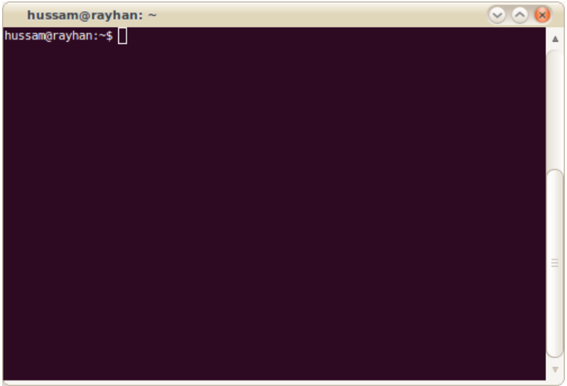

# Tóm lược về UNIX

## Mục tiêu khóa học

**Đào tạo chuyên sâu từ cơ bản đến nâng cao các công cụ và ngôn ngữ kịch bản của UNIX** : chúng ta sẽ học cách gắn kết các chương trình đơn giản lại với nhau để thực thi những tác vụ cực kỳ hiệu quả.

**Một số chủ đề bao gồm :**

* Shell, hệ thống file Unix và các công cụ đơn giản.
* Gắn kết các công cụ, chương trình với nhau \(kỹ thuật đường ống\)
* Một số công cụ phức tạp
* Biểu thức chính quy \(RegEx\)
* Xử lý luồng \(stream\)
* Kịch bản xử lý \(scripting\)
* Ngôn ngữ kịch bản
* Ngôn ngữ Python

## Script là gì ?

Là những chương trình dành cho những môi trường có thể diễn giải và tự động thực thi các tác vụ mà có thể thay thế bằng cách thực thi từng tác vụ một. \(Wikipedia\)

* Thông dịch \(không phải biên dịch\)
* Ít sử dụng các cấu trúc dữ liệu
* Thường xuyên sử dụng trong việc xử lý luồng \(stream\)

### Ví dụ đơn giản

Chúng ta cần đổi quy ước đặt tên của hàng triệu files từ `24-09-2007-picturename.jpg` thành `2007-09-24-picturename.jpg` \(đổi từ tiền tố ngày `dd-mm-YYYY` sang `YYYY-mm-dd`\)

```shell
for fn in *.jpg
  do mv $fn ‘echo $fn |\
  sed ‘s/([0-9]+)-([0-9]+)-([0-9]+)/\3-\2-\1/’‘
done
```

### Yêu cầu cơ bản

* Không cần thiết đã biết qua môi trường UNIX
* Khóa học này bao gồm CS 2042 \(công cụ\) và CS 2044 \(kịch bản xử lý\)
* Hiểu cơ bản về lập trình \(nhưng có lẽ cũng không cần thiết\)

### Tại sao bạn nên học cái này ?

> If \(you’ve never used Unix before and\) you think you’re a power  
> user now, just wait. You don’t know what real power is. - **William E. Shotts, Jr., The Linux Command Line**
>
> Nếu \(bạn chưa dùng Unix bao giờ\) và bạn nghĩ là một người dùng hiệu quả, thì hãy suy nghĩ lại. Bạn chưa biết hiệu quả thực sự là gì đâu. **William E. Shotts, Jr., The Linux Command Line**

* Cho phép chúng ta hoàn thành những tác vụ một cách những tác vụ phức tạp đòi hỏi những thao tác thủ công khó khăn.
* Một tập hợp vô hạn những cách kết hợp những chương trình và công cụ để thực hiện những tác vụ phức tạp.
* Phần thưởng : Có được kỹ năng máy tính cực kỳ tốt sau vài năm nữa từ bây giờ.
* Không giới hạn việc tinh chỉnh cài đặt trên máy tính cá nhân. Unix là một bộ công cụ được trang bị đầy đủ chứ không phải một con dao Thụy Sĩ lớn có thể giải quyết mọi vấn đề. \(Thuật ngữ Swiss Army Knife để chỉ cái gì đó rất tốt để làm dường như mọi thứ\)
* Đơn giản là nó vui & thú vị !

### Câu hỏi phỏng vấn quen thuộc kỹ sư phần mềm

Hãy viết một câu lệnh Unix để lấy ra danh sách những chương trình bạn hay sử dụng nhất.

Câu trả lời :

```shell
history | awk ’{print $2}’ | sort | uniq -c | sort -nr | head
```

Kết quả mẫu :

```
229 screen
146 exit
136 ls
81 vi
64 w
47 math
43 cp
33 cd
25 who
23 history
```

## UNIX là gì ?

* Một trong những hệ điều hành đầu tiên được sử dụng rộng rãi.
* Nền tảng cho rất nhiều hệ điều hành hiện đại.
* Hỗ trợ việc định nghĩa các chuẩn cho hệ thống xử lý đa nhiệm và đa người dùng.

### Tiểu sử ngắn của UNIX

* Thập niên 1960 : dự án đầy tham vọng MULTICS \(Multiplexed Information and Computing System\) thất bại, nhưng một số ý tưởng hạt giống \(như kỹ thuật đường ống và shell\) được đề xuất.
* Thập niên 1969 : Ken Thompson, Dennis Ritchie \(et al.\) bắt đầu làm việc trên một hệ thống file, và đặt tên là UNICS, sau này đổi thành UNIX. UNIX lúc đó là "nhỏ, đơn giản & tinh gọn", và được phân phối miễn phí cho nhiều trường đại học thời bấy giờ, nơi mà nó trở nên phổ biến.
* Thập niên 1973 : Thompson and Ritchie viết lại UNIX bằng C \(trong khi hầu hết hệ điều hành bấy giờ toàn viết bằng hợp ngữ\)
* Thập niên 1981 : Berkley UNIX 4.1 BSD xuất bản với : vi, C shell, virtual memory.
* Thập niên 1991 : Linux, GNU, and một số khác: tương tự với UNIX, nhưng mã nguồn được viết lại, rất phổ biến và sử dụng rộng rãi, miến phí. Rất nhiều phiên bản đóng gói Linux ra đời như : Ubuntu, Fedora, Debian, ...
* Hiện tại, X/Open chịu trách nhiệm phát triển UNIX.

### Kiến trúc UNIX


### UNIX Shells

Shell là một chương trình cho phép người dùng tương tác với hệ điều hành UNIX:

* Đọc và phân tích dữ liệu nhập từ người dùng
* Đánh giá, xử lý các ký tự đặc biệt
* Cài đặt các đường ống, chuyển hướng và xử lý nền.
* Tìm và cài đặt chương trình để thực thi

Có 2 biến thể Unix shell chính :

* Bourne shell \(AT&T\) sh ⇒ ksh ⇒ bash
* C shell \(Berkley\) csh ⇒ tcsh

Chúng ta sẽ tập trung vào bash : do có cú pháp dễ hiểu và được cài mặc định trong nhiều hệ thống.

### Biến thể UNIX

* Berkeley Software Distribution \(BSD\)
* GNU/Linux
* Mac OS X
* Sun’s Solaris
* IBM AIX
* HP-UX
* Silicon Graphics IRIX

### Berkeley Software Distribution

* Được phát triển bởi sinh viên và khoa công nghệ tại đại học Berkeley
* Rẽ nhánh từ phiên bản độc quyền những năm 1980 và từ đó chia ra một số biến thể, như NetBSD, OpenBSD, FreeBSD
* Tạo ra một giấy phép mã nguồn mở phổ biến. \(the BSD License\)
* Là đối thủ cạnh tranh lớn nhất với Linux trong phân khúc hệ điều hành miễn phí.

#### Ưu điểm / Nhược điểm của BSD

**Ưu điểm**

* Đáng tin cậy và rất bảo mật
* Mã nguồn tinh gọn
* Sử dụng trên hầu hết mọi thứ sài điện
* Giấy phép linh động
* Miễn phí !

**Nhược điểm**

* Bảo thủ : chậm tiến trình
* Thiếu cộng đồng hỗ trợ chuyên nghiệp
* Bạn nghĩ Linux chỉ dành cho những tay gà mờ.

### SUN Solaris

* Phiên bản thương mại hóa của BSD
* Được thiết kế để chạy trên những máy chú SPARC của Sun, từ khi chuyển sang x86
* Đa phần mã nguồn gần đây được xuất bản cho dự án OpenSolaris

#### Ưu điểm / Nhược điểm của SUN Solaris

**Ưu điểm**

* Được xây dựng cho phần cứng có thể mở rộng rất tốt về mặt độ lớn và tải.
* Rất nhiều hỗ trợ từ Sun cũng như cộng đồng.

**Nhược điểm**

* Bạn phải trả cho Sun nếu muốn được hỗ trợ và tất nhiên là phải mua luôn phần cứng.
* Chủ yếu phục vụ cho máy chủ chứ không thân thiết với máy để bàn.

### Linux!

* Chắp nối lại với nhau bởi một người Phần Lan tên là Linus Torvards
* Bắt đầu từ 1991
* Xây dựng trên nền Internet sử dụng những message boards \(Usenet\)
* Thiết kế theo chuẩn UNIX, nhưng không phải là con của UNIX.

_Note: Linux về chuyên môn mà nói chỉ là lõi \(kernel\) của những hệ điều hành, nếu không có những chương trình khác, nó thực sự có thể làm được gì_

#### Bước dịch chuyển của phần mềm miễn phí

**GNU = Gnu is Not Unix**

* Bắt đầu từ thập niên 80s trong việc xây dựng một hệ điều hành miễn phí.
* Được tạo ra bởi nhiều công cụ phổ biến.
* Theo chuẩn UNIX, những chẳng có dòng mã nào của UNIX

> There really is a Linux, and these people are using it, but it is just a part of the system they use. Linux is the kernel: the program in the system that allocates the machines resources to the other programs that you run. Linux is normally used in combination with the GNU operating system: the whole system is basically GNU with Linux added, or GNU/Linux. - **Stallman**
>
> Đó thật sự là một Linux, và mọi người đang sử dụng nó, nhưng nó chỉ là một phần của hệ thống họ đang dùng. Linux là một lõi: là một chương trình trong hệ thống sẽ cấp phát tài nguyên của máy tính cho các chương trình khác sử dụng. Linux thường được sử dụng kèm với hệ điều hành GNU: toàn hệ thống đơn giản là GNU với Linux đính kèm, hoặc gọi là GNU/Linux. - **Stallman**
>
> Think of Richard Stallman as the great philosopher and think of me as the engineer - **Torvalds**
>
> Hãy nghĩ như một triết lý gia giống Richard Stallman và hãy nghĩ như một kỹ sư giống như tôi - **Torvalds**

#### Biến thể của GNU/Linux

Cũng giống như BSD, GNU/Linux có rất nhiều biến thể. Những phiên bản này chung quy có một mục tiêu thiết kế khác nhau \(bảo mật, tốc độ, thân thiện\) và đóng gói một bộ công cụ độc quyền cùng với lõi để đạt được mục tiêu.

Hàng trăm biến thể, như RedHat, Ubuntu, SuSE, Slackware, Gentoo, v.v..

Lúc nào cũng gọi là "GNU/Linux" thì quá nhàm chán, nên cúng ta sẽ gọi toàn bộ hệ thống là "Linux".

#### Ưu điểm / Nhược điểm của Linux

**Ưu điểm**

* Cộng đồng hỗ trợ lớn
* Miễn phí \(trừ khi bạn muốn được hỗ trợ chuyên nghiệp\)
* Phần mềm miễn phí để làm mọi thứ
* "wine" \(tên 1 chương trình\) cho phép chạy mọi chương trình Windows trên Linux
* Một số biến thể bảo vệ riêng tư rất tốt

**Nhược điểm**

* Thiếu nhiều phần mềm được sử dụng rộng rãi như \(Office, Photoshop, v.v..\)

### Mac OS X

Được xây dựng dựa trên nhân của BSD, đổi tên thành "Darwin"

* Là bản có giao diện Desktop phổ biến nhất của UNIX
* Đẹp, dễ sử dụng xây dựng trên các kết cấu hiệu quả.

> What can the fully compliant UNIX technology in  
> Leopard do? It can run any POSIX-compliant source  
> code. Help you make the most of multicore systems.  
> Put a new tabbed-interface Terminal at your  
> fingertips. Introduce a whole host of new features  
> that make life easier for every developer. Really, what  
> cant it do? - **Steve Jobs**
>
> Điều gì mà công nghệ UNIX có thể làm ở bản Leopard ? Nó có thể chạy mọi mã nguồn POSIX. Giúp bạn tạo nên hệ thống đa luồng. Đặt giao diện tab vào cửa sổ dòng lệnh vào trong tay bạn. Giới thiệu một nhóm những tính năng mới sẽ làm cho cuộc sống dễ dàng hơn cho lập trình viên. Thật đó, có cái gì mà nó không làm được nhỉ ? - **Steve Jobs**

#### Ưu điểm / Nhược điểm của OSX

**Ưu điểm**

* Thân thiện người dùng & hoạt động tốt
* Đầy đủ các GUI với cửa sổ dòng lệnh hiệu quả
* Hỗ trợ mọi phần mềm mà những hệ điều hành khác thiếu

**Nhược điểm**

* Mã nguồn đóng, không linh hoạt như Linux
* Chỉ có thể chạy trên phần cứng của Apple \(nếu không muốn vi phạm luật\)

### Tại sao lại là Linux ?

* MIỄN PHÍ !
* Được sử dụng rộng rãi hơn BSD và Solaris
* Dễ dàng tìm được hướng dẫn cho người bắt đầu nếu bạn cần
* Công cụ đơn giản và hợp chuẩn

### Chúng ta sẽ sống trên một cái cửa sổ dòng lệnh UNIX



* Chúng ta sẽ tương ta với một Unix Shell : một chương trình toàn là chữ.
* Chuột, cửa sổ, và những cái nhấn chuột ở một thế giới khác!

  
Ảnh vui trên Internet : UNIX, ở đâu có shell, ở đó có con đường \(giải pháp\).

### Cài đặt Linux vào máy tính của bạn

Đây là cách thuận tiện để bạn có quyền superuser \(tối cao\) và có thể cài các chương trình thông qua các bộ quản lý đóng gói.

* Khởi động song song \(Dual boot\) : bạn có thể chạy Windows và Linux trên cùng 1 máy. \(không đồng thời\)
* Cài Linux :
  1. Chọn một biến thể Linux và tải xuống file ISO
     * www.debian.org \(ổn định nhưng ít cập nhật\)
     * www.ubuntu.com \(thân thiện người dùng nhưng có tí vấn đề riêng tư\)
     * www.gnewsense.org \(chỉ có phần mềm miễn phí\)
     * www.opensuse.org
     * www.fedoraproject.org
  2. Ghi file ISO ra đĩa CD và khởi động từ đĩa đó.
  3. Làm theo các bước chỉ dẫn và thưởng thức !

### MS Windows

Nếu bạn đang có một cái máy chạy Windows, đây là một trong các cách :

* cygwin: một môi trường giống Linux cho Windows \([http://www.cygwin.com/](http://www.cygwin.com/\))
* Bất kìa đĩa Linux Live \([http://www.livecdlist.com](http://www.livecdlist.com\))
* Linux trên USB!
* VMWare: môi trường Unix trên máy ảo chạy trên Windows

### Apple

* OSX: Cài đặt xcode và chương trình quản lý đóng gói Macports
  \([www.macports.org](www.macports.org\))
* IPad hoặc IPhone: Tải app “SSH Term Pro” \(thương mại\)

### Thời gian tiếp theo

* Chúng ta sẽ bắt tay vào việc
* _Nhắc nhở: bài tập về nhà \(đúng hơn là một khảo sát\) sẽ được đăng lên trang web khóa học. Nhớ làm nhé!_


