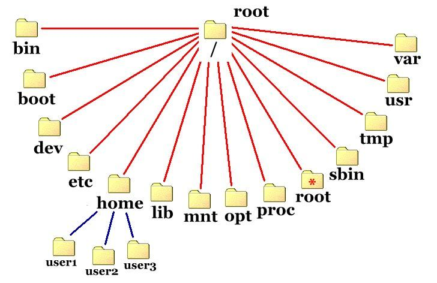

# Hệ thống file UNIX

**Ở bài học trước, chúng ta đã tìm hiểu sơ lược về hệ thống UNIX và những phiên bản của nó**

**Hôm nay sẽ đi chi tiết. Hãy xoắn tay áo của bạn lên và nhúng tay vào để trải nghiệm, đừng ngại bẩn nhé.**

## Lưu ý nhỏ

Những câu lệnh trong bài học sẽ có kiểu chữ như sau: `câu lệnh`

Một bảng tóm tắt về cách gọi câu lệnh sẽ được thể hiện dạng một danh sách gồm câu lệnh và các  đồi số  (arguments)/cờ (flags) tùy chọn đi kèm.
Ví dụ: `Câu_Lệnh [tùy_chọn_1] [tùy_chọn_2]`

Để thực thi một câu lệnh, ta chỉ cần gõ nó vào cửa sổ dòng lệnh và nhấn Enter.

## Hệ thống file UNIX

Thư mục gốc (root) được kí hiệu bởi kí tự đơn `/` (bất kể bạn có bao nhiêu ổ cứng, phân vùng hay các bộ nhớ ngoài đi kèm).

File và thư mục (directories) là một trường hợp đặc biệt:
- `hello.txt != Hello.txt`

Khác với Window, các thư mục trong UNIX được ngăn ra bởi kí tự `/`
- UNIX: `/home/user1/Documents/cs2043/2014/Lecture2/`
- Window: `D:\Documents\cs2043\2014\Lecture2\`

File ẩn được bắt đầu bởi dấu "." : .gimp

## Hệ thống phân cấp file trong UNIX

### Những thư mục đó là gì?

- `/dev`: có thể  truy cập các thiết bị phần cứng tại đây - thông thường bạn không cần đụng đến đống hỗn độn này.
- `/lib`: chứa các thư viện, cùng với `/usr/lib`, `/usr/local/lib`, ...
- `/mnt`: dùng để kết nối thêm các thiết bị lưu trữ khác vào hệ thống.
- `/usr`: lưu trữ các chương trình được cài đặt bởi người dùng và các file liên quan.
- `/etc`: cài đặt cho tầng hệ thống.

### Vậy thì những chương trình được cài đặt ở đâu?

Thông thường là ở các thư mục "nhị phân" (binary):
- `/bin`: các chương trình ở tầng hệ thống.
- `/usr/bin`: các chương trình ở mức người sử dụng.
- `/usr/local/bin`: một vài chương trình ở mức người sử dụng.

### Thế  còn tư liệu của tôi?

File của bạn sẽ được tìm thấy trong thư mục `home`, thường ở:
- `/home/tên_người_dùng`

Bạn cũng có thể truy cập thư mục `home` thông qua một kí tự đặt biệt: `~`

Những điều này có vẻ thú vị thật, nhưng làm sao để  biết ở đây nó có gì và đi đến như thế  nào ?

### Tôi đang đứng ở ?

Mặc định thì shell sẽ dùng đường dẫn hiện tại ở cửa sổ dòng lệnh. Nếu không bạn hãy thử:
- **P**rint **W**orking **D**irectory
- `pwd`
  - in ra đầy đủ đường dẫn của thư mục hiện thời.
  - rất thuận tiện khi bạn đi lạc đâu đó.
  - một biến môi trường rất quan trọng trong scritps.

### Xung quanh tôi có gì?

Trước khi ta định đến một nơi nào đó, hãy xem xung quanh ta có những gì.
- The **l**i**s**t command
- `ls [cờ (flags)] [file]`
  - In ra nội dung của thư mục (bao gồm cả thư mục con).
  - Hành vi tương tự như lệnh `dir` của DOS.
  - Tùy chọn:
    - `-l`: in ra chi tiết về file/thư mục (chúng ta sẽ tìm hiểu thêm về flag (cờ) sau).
    - `-a`: hiện ra file ẩn

### Sẵn sàng đi thôi

**c**hange **d**irectory
- `cd [tên_thư_mục]`
  - di chuyển từ thư mục hiện tại đến `[tên_thư_mục]`
  - nếu không đưa ra một thư mục cụ thể, mặc dịnh sẽ quay lại thư mục `/home`
  - chấp nhận cả đường dẫn tuyệt đối (`cd /home/user1/cs2043`) và tương đối (`cd cs2043`)

### Khi nào đường dẫn tương đối không được chấp nhận

**Đường dẫn tuyệt đối**
- Vị trí của file hoặc thư mục bắt đầu ở `/`

**Đường dẫn tương đối**
- Vị trí của file hoặc thư mục bắt đầu ở thư mục hiện thời

### Cách viết gọn cho đường dẫn tương đối

- `~`:  thư mục home của người dùng hiện tại
- `.`:  thư mục hiện tai (cực kì hữu ích - tôi hứa đấy!)
- `..`: thư mục cha của thư mục hiện tại

**Ví dụ**
- Nếu chúng ta bắt đầu ở `/usr/local/src`, sau đó:
  - `cd` hoặc `cd ~` => `/home/hussam`
  - `cd .` => `/usr/local/src`
  - `cd ..` => `/usr/local`

## Tạo file

Cách dễ nhất để tạo một file rỗng - hãy dùng lệnh `touch`.

Cách sử dụng:
- `touch [flags] <file>`
  - Có thể tùy chỉnh thời gian khởi tạo của một file cụ thể.
  - Nếu không sử dụng bất kì cờ (flags) nào, hệ thống sẽ dùng thời gian hiện tại.
  - **Nếu file chưa tồn tại**, lệnh `touch` sẽ tạo ra file đó.

Phần đuôi file (hay còn gọi là mở rộng của file) như .exe (file thực thi), .txt (file văn bản) trong hệ thống UNIX cũng như Window. Sử dụng lệnh `touch` để tạo một file thì ta sẽ thu được một file văn bản (text), vì vậy không cần phải thêm vào đuôi file .txt

## Tạo thư mục

Cực kì đơn giản.

**M**a**k**e **dir**ectory:
- `mkdir [flags] <thư_mục>`
  - Tạo thư mục mới.
  - Có thể sử dụng đường dẫn tương đối/tuyệt đối để tạo thư mục bên ngoài thư mục hiện tại.

## Xóa file

Không giống Window, một khi bạn đã xóa file bằng câu lệnh trong UNIX, thật không dễ dàng để bạn có thể khôi phục lại nó.
**R**e**m**ove file:
- `rm [flags] <tên_file>`
  - Xóa đi file <tên_file>
  - Sử dụng các kí hiệu (wildcards) chẳng hạn `*` để xóa nhiều file cùng lúc.
    - `rm *`: xóa hết file trong thư mục hiện tại.
    - `rm *.txt`: xóa hết file .txt trong thư mục hiện tại.
  - `rm -i <tên_file>`: thông báo, nhắc nhở trước khi xóa file đó.

## Xóa thư mục

Vì lệnh **`rm`** không xóa được thư mục. Thay vào đó ta dùng:
**R**e**m**ove **Dir**ectory.
- `rmdir [flags] <thư_mục>`:
  - Xóa một thư mục rỗng.
  - Thông báo lỗi nếu thư mục chứa bất kì nội dung nào (khác rỗng).

Xóa một thư mục và các thư mục con của nó, ta dùng lệnh **`rm`** với cờ (flag) **`-r`** (xóa một cách đệ qui (recursive)):
- `rm -r /home/user1/oldstuff`

## Sao chép dữ liệu (Copy)

**C**o**p**y
- `cp [flags] <file> <đích (destination)>`
  - Sao chép file từ nơi này sang nơi khác.
  - Để sao chép nhiều file cùng lúc, bạn có thể dùng các toán tử mở rộng (chẳng hạn **`*`**).
  - Để chép toàn bộ một thư mục, dùng lệnh `cp -r <thư_mục_nguồn (source)> <đích>`

