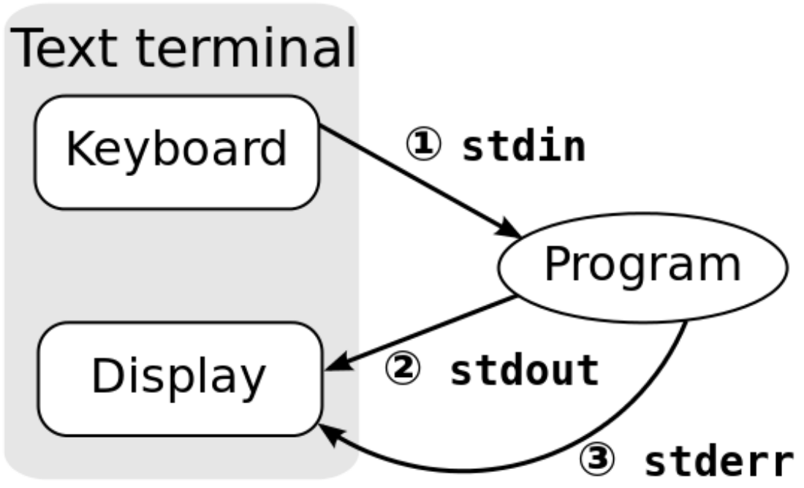

# wc, sort, uniq, tr, kỹ thuật đường ống và điều hướng, tee, backticks

## Vim: Mẹo nhỏ của ngày !

**Hiển thị số dòng code trong Vim**

```
:set nu
```

**Ẩn số dòng code trong Vim**

```
:set nonu
```

**Đi đến một dòng bất kì theo số**

```
:số_thứ_tự_dòng
```

## Đếm

**wc**

- Có bao nhiêu dòng code trong chương trình tuyệt vời của tôi ?
- Có bao nhiêu từ trong tài liệu ?
- Tốt cho việc *chém gió* (nói dóc)

**Đếm số từ, ký tự, lòng và byte với `wc`**

- `wc -l` : đếm số dòng
- `wc -w` : đếm số từ
- `wc -m` : đếm số ký tự
- `wc -c` : đếm số bytes

## Sắp xếp

**sort**

Sắp xếp các dòng của file chuỗi theo (a -> z)
- `sort -ru file`
    - sắp xếp `file` theo ký tự ngược lại (reverse) và bỏ các dòng trùng lắp
- `sort -n -k 2 -t : file`
    - sắp xếp file theo số nằm ở cột thứ 2, các cột cách nhau bởi dấu hai chấm `:`

*Ví dụ :*
Giả sử có 1 file (numbers.txt) với các số 1, 5, 8, 11, 62 nằm ở các dòng khác nhau, thì:

```
$ sort numbers.txt
1
11
5
62
8
```

```
$ sort numbers.txt -n
1
5
8
11
62
```

## Duy nhất

**uniq**

- `uniq file` - Bỏ qua tất cả các dòng có giá trị trùng
- `uniq -c file` - Bỏ qua tất cả các giá trị trùng, nhưng có thêm số lần lặp ở trước mỗi dòng

## Xử lý ký tự !

**Hàm thông dịch ký tự**

`tr [các tùy chọn] <danh sách ký tự 1> [danh sách ký tự 2]`
- Thông dịch hay xóa bỏ các ký tự
- Danh sách ký tự là một chuỗi các ký tự
- Mặc định, tìm kiếm ký tự ở **danh sách ký tự 1** và thay thế bằng ký tự có vị trí tương ứng ở **danh sách ký tự 2**

**Ví dụ:**

`tr 'AEUIOU' 'aeiou'` - thay thế các nguyên âm viết hoa thành nguyên âm viết thường

## Kỹ thuật đường ống và chuyển hướng (pipes and redirection)

- `tr` chỉ nhận đầu vào (input) chuẩn (stdin)
    - ví dụ: đầu vào từ bàn phím
- Thế nếu chúng ta muốn làm việc với file thì sao ?
    1. Kỹ thuật đường ống (piping) : `cat somefile | tr 'AEUIOU' 'aeiou'`
    2. Chuyển hướng đầu vào : `tr 'AEUIOU' 'aeiou' < somefile`

> Kỹ thuật đường ống và chuyển hướng đầu vào / ra rất là quan trọng và hữu ích trong suốt UNIX

## Ôn lại về chuyển hướng

**Ứng dụng trong UNIX được giao tiếp với luồng đầu vào / ra (Input / Output) :**
- \#0 : luồng đầu vào chuẩn; STDIN (thường là bàn phím)
- \#1 : luồng đầu ra chuẩn; STDOUT (thường là cửa sổ dòng lệnh)
- \#2 : luồng báo lỗi chuẩn; STDERR (phụ thuộc theo cấu hình hệ thống, nhưng thường là cửa sổ dòng lệnh)

**Triết lý UNIX**

> Trong UNIX, bạn sẽ tìm ra nhiều công cụ đặc trưng trong 1, 2 thứ, và chúng làm nó rất tốt! Để làm những chức năng phức tạp hơn bằng cách ghép nối từng công cụ một bằng kỹ thuật đường ống hoặc chuyển hướng vào/ra

## Luồng dữ liệu chuẩn


Nguồn:
- https://en.wikipedia.org/wiki/Standard_streams#/media/File:Stdstreams-notitle.svg

## Kỹ thuật đường ống
Ngôn ngữ kịch bản Bash là việc ghép nối những dòng lệnh lại với nhau để làm một điều gì có hiệu quả. Điều đó có thể giải quyết bằng "đường ống".

`<lệnh 1> | <lệnh 2>`
- Truyền đầu ra của lệnh 1 vào đầu vào của lệnh 2
- Hoạt động trên nhiều chương trình nhận đầu vào và cung cấp đầu ra cho cửa sổ dòng lệnh.

### Ví dụ về kỹ thuật đường ống

`ls -al /bin | less`
- Cho phép bạn kéo qua một danh sách dài các chương trình trong thư mục `/bin`

`history | head -20 | tail -10`
- Hiển thị lệnh thứ 10 - 19 trong các lệnh sử dụng gần đây từ phiên hoạt động hiện tại.

## Kỹ thuật điều hướng

Để điều hướng luồng Vào / Ra, sử dụng một trong `>` `>>` `<` luồng vào / ra
- để điều hướng chuẩn đầu vào, sử dụng toán tử `<` : `lệnh < file`
- để điều hướng chuẩn đầu ra, sử dụng toán tử `>` : `lệnh > file`
- để điều hướng chuẩn báo lỗi, sử dụng toán tử `>` và chỉ rõ luồng bởi con số (2) : `lệnh 2> file`

**Hòa trộn luồng**
Bạn có thể gộp 2 luồng lại với nhau bằng cách sử dụng `2>&1`. Điều này có nghĩa là: gửi chuẩn báo lỗi vào nơi mà chuẩn đầu ra sẽ đi tới. Rất hữu ích cho việc kiểm tra / bắt lỗi.

### Ví dụ về kỹ thuật điều hướng

**Tiến trình Bash điều hướng nhập xuất từ trái qua phải, cho phép chúng ta làm một số thứ thú vị như cái này :**

Hãy xóa mọi thứ chỉ trừ số từ file `test1.txt`, sau đó lưu chúng vào file `test2.txt`

`tr -cd '0-9' < test1.txt > test2.txt`

## Một số ví dụ đơn giản

**`echo *` in tất cả mọi file trong thư mục, cách nhau bởi khoảng cách, hãy làm cho chúng cách nhau bởi dòng mới:**

`echo * | tr ' ' '\n'`

**Hãy cùng viết hoa mọi thứ trong file**

`tr 'a-z' 'A-Z' < test.txt` - in nội dung của file text.txt dưới dạng viết hoa.

### Đặt mọi thứ lại với nhau

Chúng ta có thể đặt một số lệnh trên lại với nhau để làm những điều thú vị.

```
tr 'A-Z ' 'a-z\n` < file.txt | sort | uniq -c | sort -rn | head -n 10
```

Đọc file `file.txt`, chuyển tất cả ký tự thành chữ thường, thay thế kí tự khoảng trắng bằng ký tự xuống dòng, sắp xếp kết quả có được, đếm những từ lặp lại, và lại sắp xếp chúng lần nữa theo thứ tự ngược lại (in ra những từ phổ biến nhất), sau đó hiển thị 10 từ đầu tiên.

Điều này rất hiệu quả trong việc tính toán từ được lặp lại nhiều nhất trong file `file.txt` (mà không xử lý chấm câu, chúng ta sẽ xử lý sau)

### "Bữa tiệc trà" (tee ~ tea)

Nếu bạn muốn điều hướng đầu ra tới một file và vẫn muốn thấy nó ở stdout ?

**tee example**
```
ls -1 | tee file.txt
```

### /dev/null - lỗ đen

`/dev/null` là một file đặc biệt với các thuộc tính :
- Mọi người dùng đều có thể ghi vào nó
- Mọi thứ được ghi chẳng đi tới đâu cả
- Nó luôn trả về trạng thái ghi thành công.

**Nó hoạt động như một cái lỗ đen của dữ liệu - bạn có thể xuất ra tới nó mọi lúc và nó chẳng bao giờ đầy. Mọi thứ bạn điều hướng vào `/dev/null` đều biến mất.**

### Giải quyết việc xuất ra dư thừa

Nhiều chương trình xuất ra liên tục trong quá trình nó chạy. Ví dụ như `ping` và `play`, cả 2 làm cửa sổ dòng lệnh bừa bộn với những gì chúng xuất ra, mặc dù là chạy nền.

**Giải pháp là sử dụng điều hướng đầu ra**

`ping google.com > testping.log &`

Khi bạn quan tâm về đầu ra của chương trình, hãy điều hướng nó ra file log.

`play somesong.mp3 > /dev/null &`

Nếu đầu ra dạng chữ không quan trọng, điều hướng nó tới `/dev/null`

## Quay trở lại lệnh tr

### tr và sets

- Nếu 2 tập hợp được truyền vào `tr` có độ dài như nhau thì ký tự đầu tiên của tập hợp thứ nhất sẽ được thay thế bằng ký tự đầu tiên của tập thứ hai và cứ như thế.
- Nếu tập hợp thứ hai ngắn hơn thứ nhất, thì chúng cũng sẽ chạy và mọi ký tự dư ra sẽ được thay thế bằng ký tự cuối cùng của tập hợp thứ 2.
- Nếu tập hợp thứ nhất ngắn hơn, chỉ có những ký tự tương ứng của tập hợp thứ 2 mới có nghĩa.

**Ví dụ:**
```
$ echo "abcdefghijklmnopqrstuvwxyz" | tr 'a-z' 'a'
aaaaaaaaaaaaaaaaaaaaaaaaaa
$ echo "abcdefghjiklmnopqrstuvwxyz" | tr 'a-z' 'wxyz'
wxyzzzzzzzzzzzzzzzzzzzzzzz
```

### Tùy chọn của lệnh tr

**`tr` có một vài tùy chọn hữu ích:**
- `tr -d <tập hợp>` - xóa tất cả các ký tự có trong tập hợp
- `tr -c <tập hợp 1> <tập hợp 2>` - bổ sung tập hợp 1 trước khi thay thế nó bởi tập hợp 2

**Ví dụ:**

Hãy in một file mà tất cả chắc ký tự khác chữ cái được gỡ bỏ

```
tr -cd 'a-zA-Z' < somefile
```

### Tập hợp các ký tự POSIX

**`tr` hiểu các tập hợp ký tự POSIX**
- `[:alnum:]` : ký tự chữ cái hoặc số
- `[:alpha:]` : ký tự chữ cái
- `[:digit:]` : con số
- `[:punct]` : dấu chấm câu
- `[:lower:]` : ký tự chữ cái thường
- `[:upper:]` : ký tự chữ cái hoa
- `[:space:]` : ký tự khoảng trắng

## Backticks - ký tự nháy (bên trên phím Tab)

- Backticks xung quang câu lệnh: shell sẽ mở rộng lệnh này, thay thế biểu thức bên trong backticks bằng kết quả đầu ra của biểu thức.

**Ví dụ**

Lệnh `whoami` in ra tên của người dùng hiện tại
- ``echo `whoami` ``
- ``ssh `whoami`@csug01.csuglab.cornell.edu``

## Thay thế Cypher

**Đây là cách mà thông điệp bí ẩn từ bài tập về nhà 1.**

Chúng ta có thể sử dụng `tr` để thay thế cypher. Tạo một file chuỗi gọi là `cypher` với sắp xếp lại theo alphabet. Sau đó để mã móa, chúng ta có thể làm như sau:

`tr 'a-z' 'cat cypher' < file > exclodedfile`

và để giả mã, chúng ta làm như sau

`tr 'cat cypher' 'a-z' < encodedfile > decodedfile`